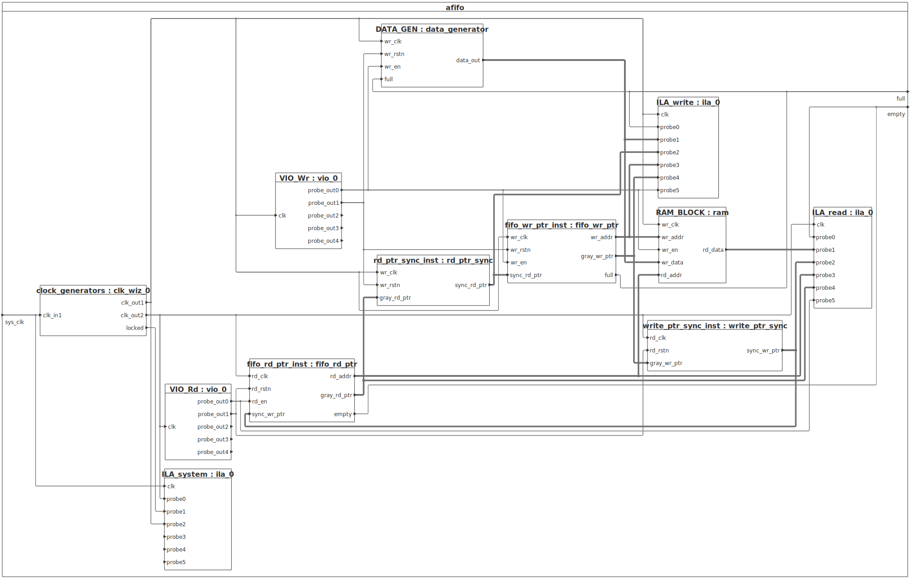
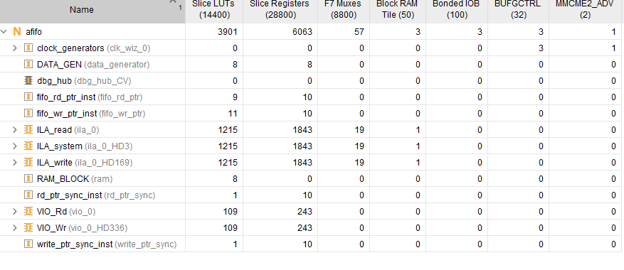
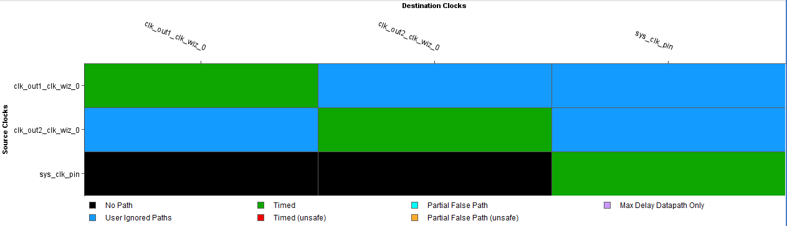

# On-Chip-FPGA Analysis of Asynchronous FIFO with Xilinx Debug cores
The objective of this repository is to showcase how Xilinx Debug Cores such as VIO (Virtual Input/Output) & ILA (Integrated Logic Analyser) can be used to perform on-chip FPGA analysis and debug in real time.
The ILA and VIO cores are useful in controlling and monitoring internal signals of the FPGA thus easing the debug if design fails to work as intended

The Design being analysed is the Asynchronous FIFO taken from another Public Github Repository https://github.com/MahmouodMagdi/Clock-Domain-Crossing-Synchronizers/ and is implemented on the Zynq7000 SoC on CoraZ7 board.

## System Block Diagram

The design takes system clock (125 MHz) input from on board generated clock arriving on pin H16 (of CoraZ7), Please refer the CoraZ7 constraints file https://github.com/Digilent/digilent-xdc/blob/master/Cora-Z7-07S-Master.xdc for the pinout of the FPGA.
# Clock Generators
The clocking wizard generates two free running clocks in the design from system clock.
The generated clocks are 25 MHz(Write clock) and 15 MHz(Read clock) 90° out of phase so both clocks are completely asynchronous

# Data Generator
A simple counter is implemented to count on every write clock to emulate a data supposed to be written inside the Asynchronous FIFO when the write enable signal to FIFO is high and full flag is low

# ILA
There are total three ILA cores being used in the design, The ILA_system core is sampling the generated clocks (write & read clocks) to visually verify weather the clocks with correct frequencies are generated, The sampling clock to this ILA is a system clock 125MHz, the same one connected to input of clocking wizard, as ILA sampling clock should be much higher than the signals it samples otherwise ILA will fail to display signals

The ILA_write is sampling the write domain signals specifically write data generated from Data generator, write address calculated by the fifo_wr_ptr, full flag and the synchronised read pointer being synchronized from read domain in the write domain.
The ILA_read is sampling the read domain signals specifically read_data, read address calculated by fifo_rd_ptr, empty flag and synchronised write pointer synchronised from the write domain in the read domain.

# VIO

There are two VIO cores used to control signals which otherwise would be controlled externally but for the sake of this emulated design, VIO cores are used to control signals.
VIO_Wr is used to control write enable of the Asynchronous FIFO and write reset.
VIO_Rd is used to control the read enable of the Asynchronous FIFO and read reset

# Synthesis
The design is synthesized for Zynq7000 SoC, Below are the resource usage, the following utilization is of top level excluding the OOC run modules such as VIO, ILA, Clocking wizard
| Site Type                  | Used | Fixed | Prohibited | Available | Util% |
|----------------------------|------|-------|------------|-----------|--------|
| **Slice LUTs\***           |   38 |     0 |          0 |     14400 |  0.26% |
| &nbsp;&nbsp;LUT as Logic   |   30 |     0 |          0 |     14400 |  0.21% |
| &nbsp;&nbsp;LUT as Memory  |    8 |     0 |          0 |      6000 |  0.13% |
| &nbsp;&nbsp;&nbsp;&nbsp;LUT as Distributed RAM | 8 | 0 | — | — | — |
| &nbsp;&nbsp;&nbsp;&nbsp;LUT as Shift Register  | 0 | 0 | — | — | — |
| **Slice Registers**        |   48 |     0 |          0 |     28800 |  0.17% |
| &nbsp;&nbsp;Register as Flip Flop | 48 | 0 | 0 | 28800 | 0.17% |
| &nbsp;&nbsp;Register as Latch     | 0  | 0 | 0 | 28800 | 0.00% |
| **F7 Muxes**               |    0 |     0 |          0 |      8800 |  0.00% |
| **F8 Muxes**               |    0 |     0 |          0 |      4400 |  0.00% |

The total resource utilization including the OOC run modules is 

Due to asynchronous nature of the generated clocks, timing constraints set_clock_groups were applied to avoid timing between the write and read domains and to avoid timing failure.

The report clock interaction shows the following diagram indicating a relationship between clocks weather path between the domains were timed or untimed and weather timing met between domains or not.

The synthesized schematic is shown as below 

# Implementation

The implemented design is shown as below

The resource utilization post implementation is shown as below, The final LUT count is reduced after the optimizations run by Vivado in the implementation stage

# Real time ILA Debug

The following waveform shows ILA debug window in Vivado Hardware manager where a write operation in the Asynchronous FIFO can be observed as soon as write enable is activated and write reset is driven low. The full flag asserts when the FIFO is completely full

The following waveform shows when read operation starts by enabling read enable signal and by driving read reset to low, a read data can be seen on the read data bus and empty flag asserts indicating FIFO is empty again

